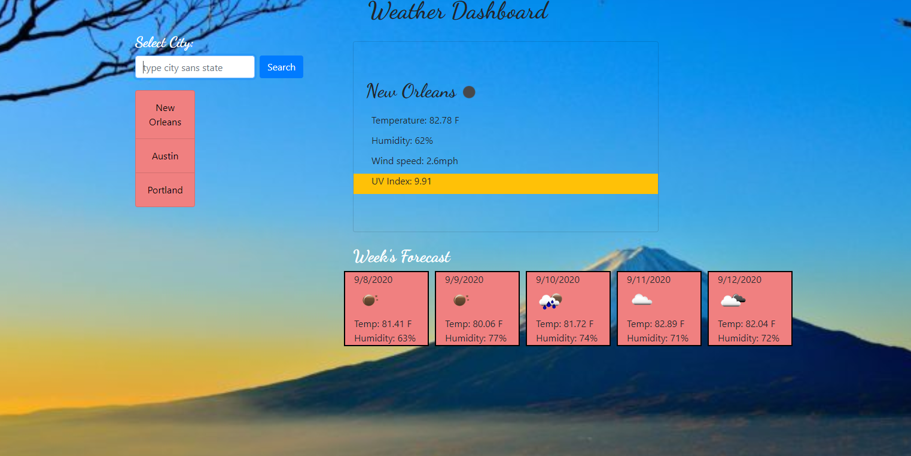

# weatherDashboard

## Deployed Site: https://94cooper94.github.io/weatherDashboard/

Greetings, Traveler!

Thank you for viewing my all-in-one weather dashboard (sample below).

Here you'll find a simple user-interface that requests location input and returns rivoting weather data. Try entering your city's name, zip code, or even your entire state's name, and this weatherDashboard will give you everything you're looking for-- even emojis! 

Now functioning as of patch 1.07.33b: the 5-day weather forecast is up and running in full-effect, & the search history displays without the need to refresh your web browser.

Coming soon: perpetuous updates to ensure quality aesthetic content and functionality of the weather API persists.

## Technologies Used 
- GitHub & GitHub Pages
- HTML & CSS
- Materialize CSS & JavaScript Bootstrap
- JavaScript & JQuery
- OpenWeatherAPI