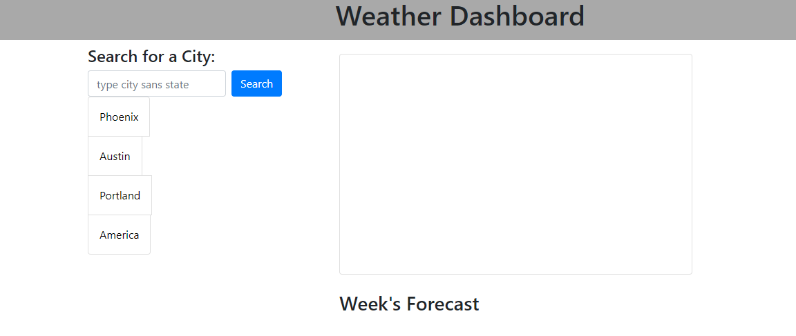
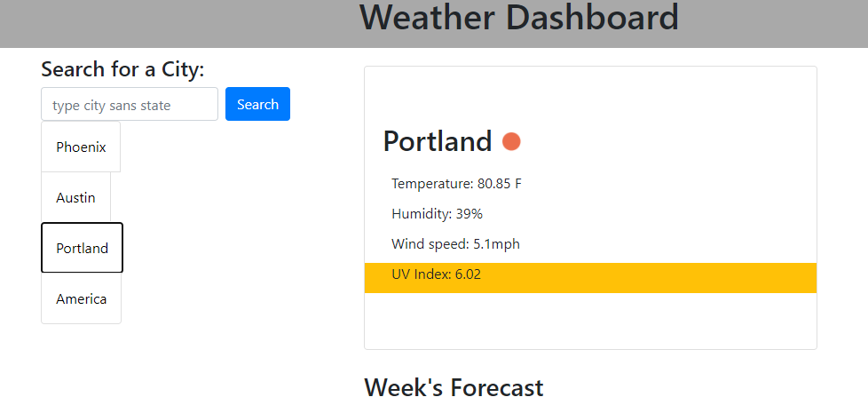
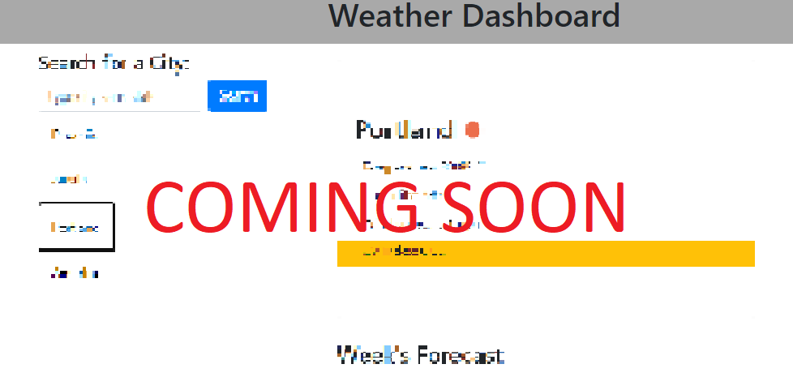

# weatherDashboard

https://94cooper94.github.io/weatherDashboard/

Greetings, Traveler!

Thank you for viewing my all-in-one weather dashboard (sample below).

Here you'll find a simple user-interface that requests a city input. Don't include the state or country, however, as this dashboard gets the final say regarding which city you're referring to. Slick bonus features include an extensive search history feature (refresh that webpage to see what I'm talking about) that generates that day's weather forecast at the click of a button(s)!

Coming soon: a more cutting edge search history that refreshes without reloading the page AND a 5-day forecast! Keep your eyes peeled.

